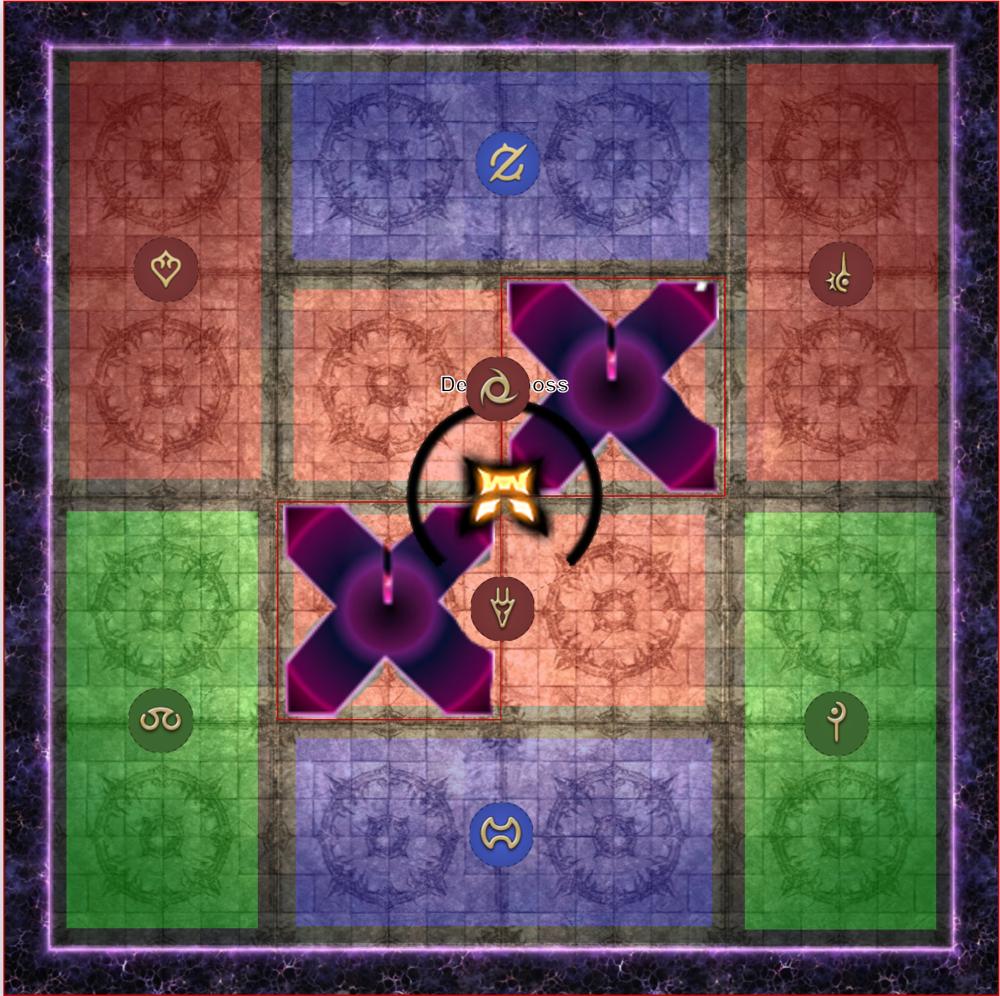
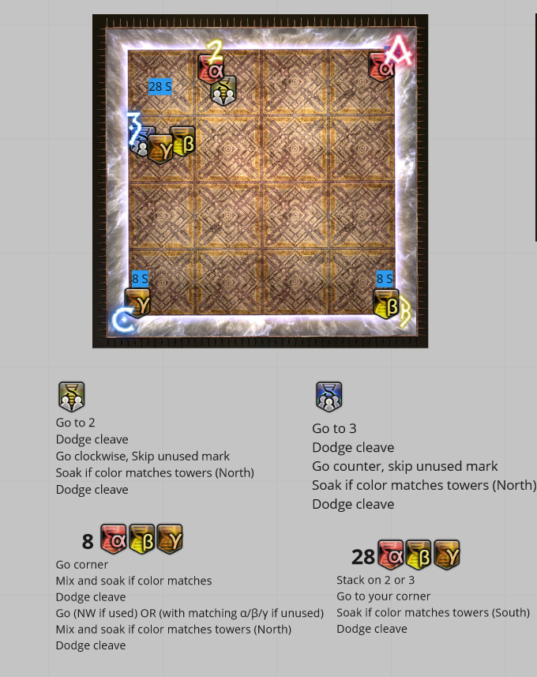
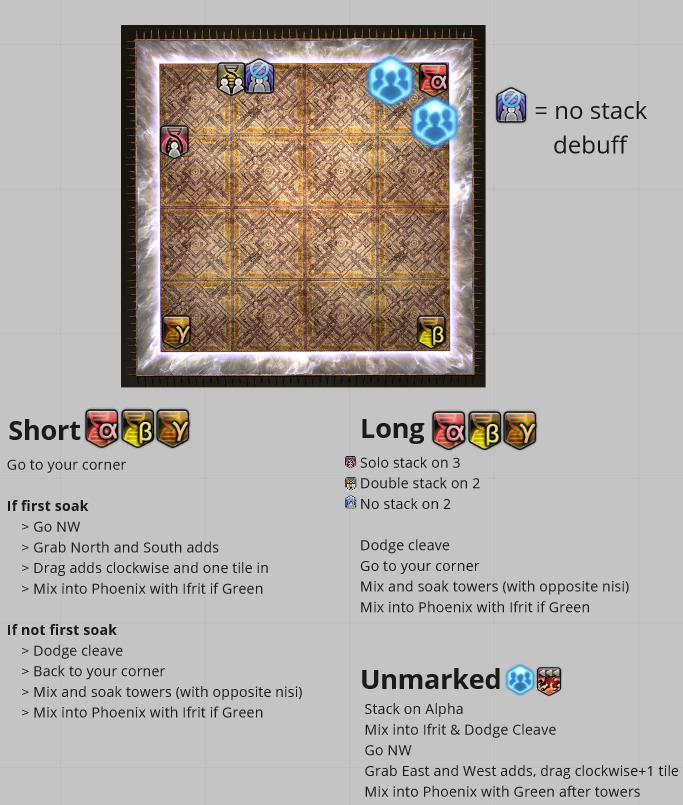

# Wayfinders P5S - P8S Strats

## Light Parties  

| Light Party 1 | Light Party 2 |
| ------------- | --------------|
| Alex |  Tzu
| Xaria |  Sereane
| Vel |  Faust
| Akari |  Rassi  

---  

### **P5S**
--- 
#### **Puddles/Towers**  
Tanks N/CCW - N After Devour  
Melee E/CW - S After Devour  
Healer NW/CCW - W after Devour  
Ranged NE/CW - E after Devour  

#### **Ruby 5**  
LP1 N/W  
LP2 S/E  
Tank Stay, Melee Close, Healer Mid, Range Far. Stack on healer then move close.  

#### **Ruby 4/6**
LP1 Inside  
LP2 Against Wall  

#### **Ruby 6**  
NW Square Prio/ NE otherwise  

---  
### **P6S**
---  

#### **Pathonogenic Cells**  
Diamond Weapon

#### **Agonies 1**  
LP1 West Corners,  LP2 East Corners  T/R N H/M S  

#### **Poly 2**  
Bait center  

#### **Agonies 2**  
Supports NW, DPS SE  

#### **Poly 3**  
Square adjacent to the shapes in the corner. LP1 Far, LP2 Close

#### **Dark Ashes**  
LP1 West, LP2 East - T North close, Range North far, M South in, H South out 

#### **Cachexia 1**  
N to S:  
8 -> 12 -> 16 -> 20  
20 starts in and goes ***SOUTH***

#### **Poly 4**  
  

---  
### **P7S**
---  

#### **Forbidden Fruit 1**  
LP1 Close, LP2 Far  

#### **Spread/Stack with Role Groups**  
LP1 West, LP2 East. T/M North, H/R South  

#### **Forbidden Fruit 2**  
LP1 NW Platform, LP2 NE Platform  

#### **Forbidden Fruit 1**  
LP1 knockback west, LP2 knockback east

#### **Forbidden Fruit 5 (Birds/towers)**
LP1 West, LP2 East. T/M North, H/R South  

#### **Purgation**
Sleepo
A/1         T1 / M1  
Center      T2 / M2  
C/3         H1 / R1  
D/4         H2 / R2  

#### **Harvest's**
**Famine** The only one? Cross bull tethers  
**Death** JP Braindead  
**War** Inumaru

---  
### **P8S Part 1**
---  

**Spread Postions**  
R1&nbsp;&nbsp;&nbsp;&nbsp;&nbsp;&nbsp;T1&nbsp;&nbsp;&nbsp;&nbsp;&nbsp;R2  

T2&nbsp;&nbsp;&nbsp;&nbsp;&nbsp;&nbsp;&nbsp;&nbsp;&nbsp;&nbsp;&nbsp;&nbsp;&nbsp;&nbsp;&nbsp;H2

M1&nbsp;&nbsp;&nbsp;&nbsp;H2&nbsp;&nbsp;&nbsp;&nbsp;M3  

#### **Centaur (Dog) 1**
Updog

#### **Snake 1**
LP1 NW/CCW, LP2 N/CW
T1/T2 swap when necessary
M1/M2 swap when necessary

#### **FourFold**
LP1 West priority, LP2 East priority  
Uptime if half arena, tanks back off if corners

**Spread Postions**  
&nbsp;&nbsp;&nbsp;&nbsp;&nbsp;&nbsp;&nbsp;&nbsp;&nbsp;&nbsp;&nbsp;&nbsp;&nbsp;&nbsp;&nbsp;&nbsp;&nbsp;&nbsp;&nbsp;&nbsp;T1  
&nbsp;&nbsp;&nbsp;&nbsp;&nbsp;&nbsp;&nbsp;&nbsp;&nbsp;&nbsp;M1&nbsp;&nbsp;&nbsp;&nbsp;&nbsp;&nbsp;&nbsp;&nbsp;&nbsp;&nbsp;&nbsp;&nbsp;&nbsp;&nbsp;&nbsp;M2  
&nbsp;&nbsp;&nbsp;&nbsp;&nbsp;&nbsp;&nbsp;&nbsp;&nbsp;&nbsp;&nbsp;&nbsp;&nbsp;&nbsp;&nbsp;&nbsp;&nbsp;&nbsp;&nbsp;&nbsp;T2  
R1&nbsp;&nbsp;&nbsp;&nbsp;&nbsp;&nbsp;H1&nbsp;&nbsp;&nbsp;&nbsp;&nbsp;&nbsp;&nbsp;&nbsp;&nbsp;&nbsp;&nbsp;&nbsp;&nbsp;&nbsp;&nbsp;H2&nbsp;&nbsp;&nbsp;&nbsp;&nbsp;&nbsp;R2  

#### **Centaur (Dog) 2**
Healer Stacks: LP1 Wall, LP2 First Marker
Partner Stack: T1/M1 Wall -> T2/M2 -> H1/R1 -> H2/R2

#### **Snake 2**
Spriggan
LP1 NW/CCW, LP2 N/CW

---  
### **P8S Part 2**
---  

#### **NA 1**
Party stacks D  
Stack first, Party to 4 (edge of hitbox), NA to wall  
Spread first, Clock spreads. 

***Spread first clock spread Postions***  
M1&nbsp;&nbsp;&nbsp;&nbsp;&nbsp;&nbsp;T1&nbsp;&nbsp;&nbsp;&nbsp;&nbsp;M2  

T2&nbsp;&nbsp;&nbsp;&nbsp;&nbsp;&nbsp;&nbsp;&nbsp;&nbsp;&nbsp;&nbsp;&nbsp;&nbsp;&nbsp;&nbsp;&nbsp;&nbsp;R2

R2&nbsp;&nbsp;&nbsp;&nbsp;&nbsp;&nbsp;H1&nbsp;&nbsp;&nbsp;&nbsp;&nbsp;&nbsp;H2  

***Spread second Postions***  
East or West ***Not Mirrored***   
T1 -- M1  
T2 -- M2  
H1 -- R2 (Rdm uptime)  
H2 -- R1  

*Scripe Fire/Ice*  
T2/M2 Flex  
If T2 flex Tanks are North or South Fire  
If M2 flex Melee are North or South Fire  
Healers always West if no NA  
Range always East if no NA  

#### **HC 1**  
  

#### **Limitless Desolation**  
***Spread Positons***  
T1 -- M1  
T2 -- M2  
H1 -- R2 (Rdm uptime)  
H2 -- R1  

 

#### **NA 2**  
Spreads TBD  (I just don't feel like making a diagram)  
NA on center line  
Stack: Party Stack on N/S away from NA  
Spread: NA stays middle, Group spreads (ill make a diagram for this at some point)  
Fire/Ice - Same as NA 1

#### **HC 2**  
  

#### **Dominion 1/2**  

***Spreads***  
Supports West, DPS East  
T/M North, H/R South  

***Towers***  
From West to East Priority Groups  
Tank -> Healer -> Melee -> Ranged

If both members of a priority group are in the same tower group LP1 -> LP2 West prio  
i.e. T1/T2/M1/R2 hit first => T1 -> T2 -> M1 -> R2