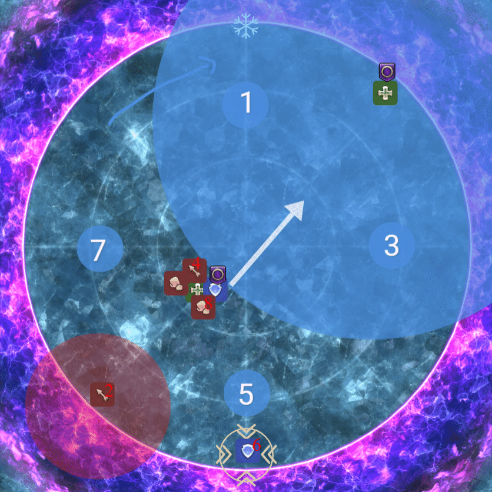

# Wayfinders P9S - P12S Strats

## Light Parties  

| Light Party 1 | Light Party 2 |
| ------------- | --------------|
| Alex |  Tzu
| Xaria |  Mosh
| Vel |  Faust
| Ori |  Zeid  

---  

### **P9S**
--- 

#### **DualSpell** 
DPS Rotate Clockwise

#### **Levinstrike Orbs/Scrambled Succession** 

JP Orbs

  

#### **Charybdis (Meteors)** 
NW Clockwise Meteor Priority
Role Colors

Tank - Red
Healer - Yellow
Melee - Blue
Ranged - Purple

Light Party 1 first Meteor
DPS First Protean

#### **Chimeric Succession** 
TBD