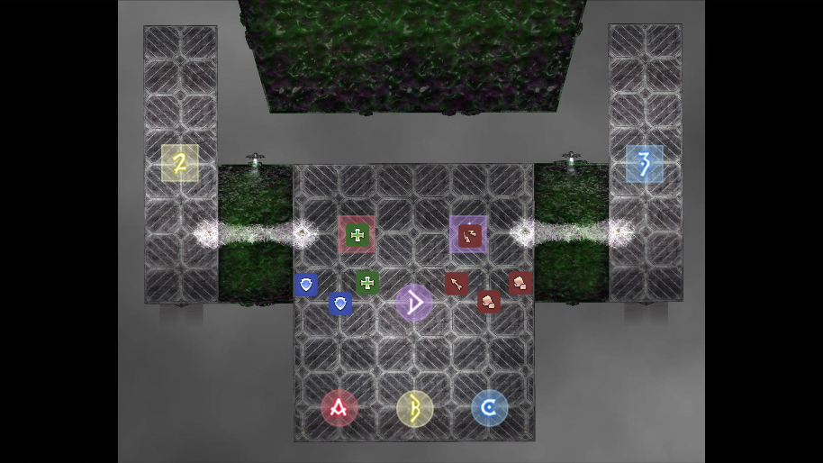
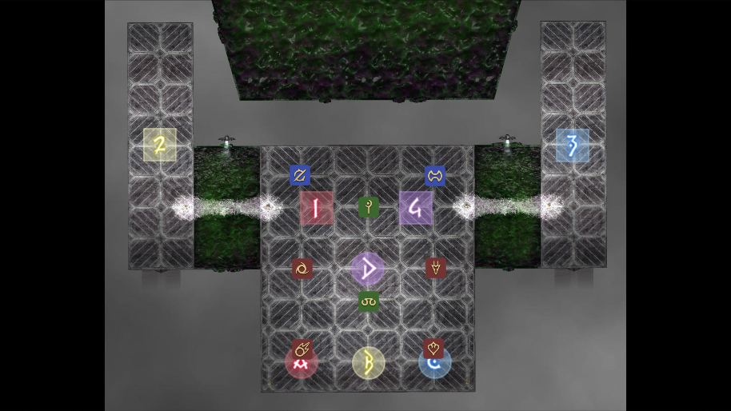
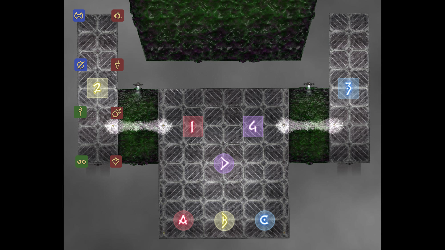
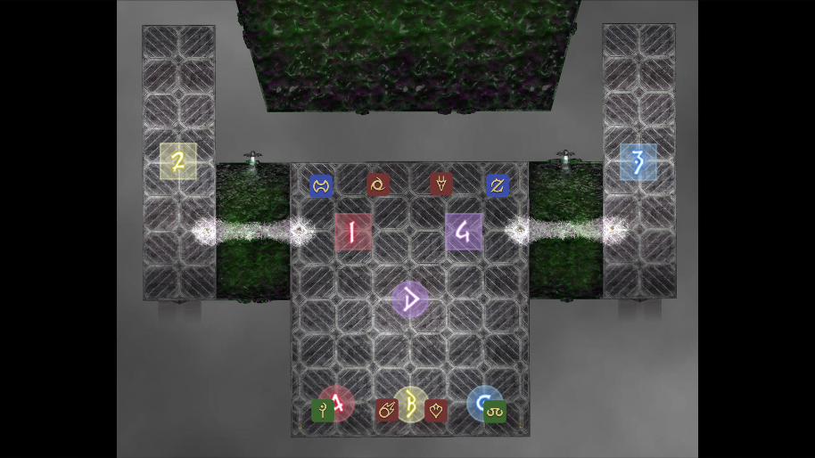
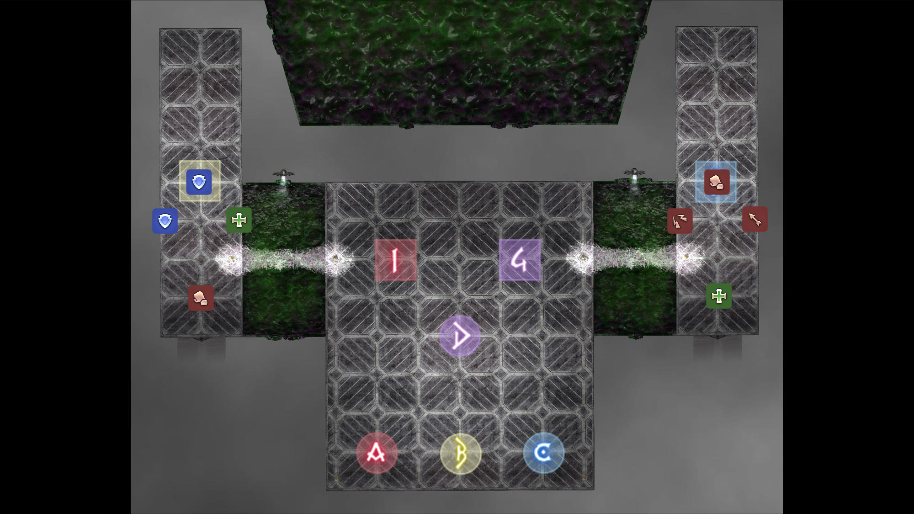
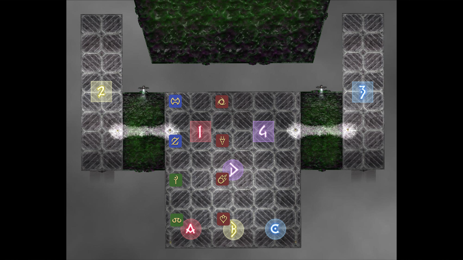

# Wayfinders P9S - P12S Strats

## Light Parties  

| Light Party 1 | Light Party 2 |
| ------------- | --------------|
| Alex |  Tzu
| Xaria |  Mosh
| Vel |  Faust
| Ori |  Zeid  

---  

### **P9S**
--- 

#### **DualSpell** 
DPS Rotate Clockwise

#### **Shockwave** 
Rotate Clockwise to Ice Wall

#### **Levinstrike Orbs/Scrambled Succession** 

***JP Orbs***  
1st/2nd Defamation between orbs 1/3.  
2/4 marked player takes fire kicks between orbs 5/7. 

3rd/4th Defamtion between orbs 5/7.  
6/8 marked player takes fire kicks between orbs 1/3  

  

#### **Charybdis (Meteors)** 
NW Clockwise Meteor Priority  
Role Colors

Tank - Red  
Healer - Yellow  
Melee - Blue  
Ranged - Purple  

Light Party 1 first Meteor  
DPS First Protean

#### **Chimeric Succession** 
Tanks/Melee In   
Healers/Ranged Out to bait defamation

Odd defamation 1    
Even Defamation 4

Stack South

---  

### **P10S**
--- 

Zeid/Ori Swap Light Parties for this fight  

| Light Party 1 | Light Party 2 |
| ------------- | --------------|
| Alex |  Tzu
| Xaria |  Mosh
| Vel |  Faust
|  Zeid |  Ori  

***Dividing Wings 1***  
West tether breaks west group, east breaks east.  
Positions  
  

***Silk Spreads***  
Positions  
  

***Towers***  
Positions  
  

***Single Platform***  
Positions  
  

***Turret Towers***  
Spread Positions for Bonds 2 are roughly the same as turret tower positions.  
Positions  
  

***Dividing Wings 2***  
Tethers go to connected platform
Positions  
 

***Bonds 3***  
Spread Positions  
  

Stack Positions  
  

